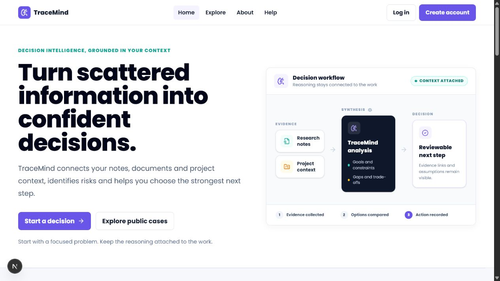

# TraceMind Client

TraceMind is a decision-intelligence workspace that helps people connect case context, documents, risks, and AI-assisted recommendations in one reviewable workflow. This repository contains the responsive Next.js frontend for the TraceMind application.

## Links

- GitHub repository: [tracemind-client](https://github.com/RizviBR0/tracemind-client)
- Backend repository: [tracemind-server](https://github.com/RizviBR0/tracemind-server)
- Live application: [tracemind-client.vercel.app](https://tracemind-client.vercel.app/)


## Screenshot



## Main technologies

- Next.js 16 App Router and React 19
- TypeScript
- Tailwind CSS 4
- TanStack Query for server state and caching
- Recharts for analytics charts
- React Hook Form and Zod for form validation
- Lucide React for interface icons

## Core features

- Responsive landing page with public navigation, feature sections, live statistics, FAQ, trust links, and calls to action.
- Public case exploration with search, category and priority filters, sorting, pagination, loading skeletons, and case cards.
- Public case details with goals, constraints, related cases, ratings/reviews, saving, sharing, and reporting.
- Email/password registration and login, demo-account autofill, Google OAuth entry point, validation, errors, and protected routes.
- Protected case creation and management with private/public visibility, moderation status, delete/view actions, cover image URLs, and supporting PDF, DOCX, TXT, PNG, and JPG uploads.
- Decision workspace with conversational AI recommendations, context-aware follow-up prompts, regeneration, save/publish controls, risks, assumptions, alternatives, and action items.
- Document intelligence workflow with processing progress and generated summaries, key points, risks, tags, action items, and downloadable reports.
- User analytics dashboard with Recharts visualizations and an admin area for user status and public-case moderation.
- Additional About, Help, Privacy, Profile, Saved Cases, and admin pages.

## Dependencies

Runtime dependencies are declared in [`package.json`](package.json). The main application dependencies are:

`next`, `react`, `react-dom`, `@tanstack/react-query`, `recharts`, `react-hook-form`, `@hookform/resolvers`, `zod`, `react-toastify`, `lucide-react`, and `@fontsource/poppins`.

Development dependencies include TypeScript, Tailwind CSS 4, the Next.js ESLint configuration, and the React compiler plugin.

## Run locally

### Prerequisites

- Node.js 20 or newer
- The TraceMind server running locally or a deployed server URL

### Setup

1. Clone the repository and enter the client directory:

   ```bash
   git clone https://github.com/RizviBR0/tracemind-client.git
   cd tracemind-client
   ```

2. Install dependencies:

   ```bash
   npm install
   ```

3. Create `.env.local` from `.env.example` and set the server URL. The public variables are safe to expose in the browser:

   ```env
   NEXT_PUBLIC_API_URL=http://localhost:5000/api/v1
   NEXT_PUBLIC_SERVER_URL=http://localhost:5000
   NEXT_PUBLIC_SITE_URL=http://localhost:3000
   NEXT_PUBLIC_DEMO_EMAIL=demo@tracemind.app
   NEXT_PUBLIC_DEMO_PASSWORD=TraceMindDemo2026!
   ```

4. Start the development server:

   ```bash
   npm run dev
   ```

5. Open [http://localhost:3000](http://localhost:3000).

### Production checks

```bash
npm run lint
npm run build
npm run start
```

Keep server-only secrets in the backend `.env`; never put MongoDB, JWT, Gemini, OAuth, or other private credentials in `.env.local`.

## Related resources

- [Next.js documentation](https://nextjs.org/docs)
- [TanStack Query documentation](https://tanstack.com/query/latest)
- [Recharts documentation](https://recharts.org/en-US/)
- [TraceMind server README](https://github.com/RizviBR0/tracemind-server#readme)
